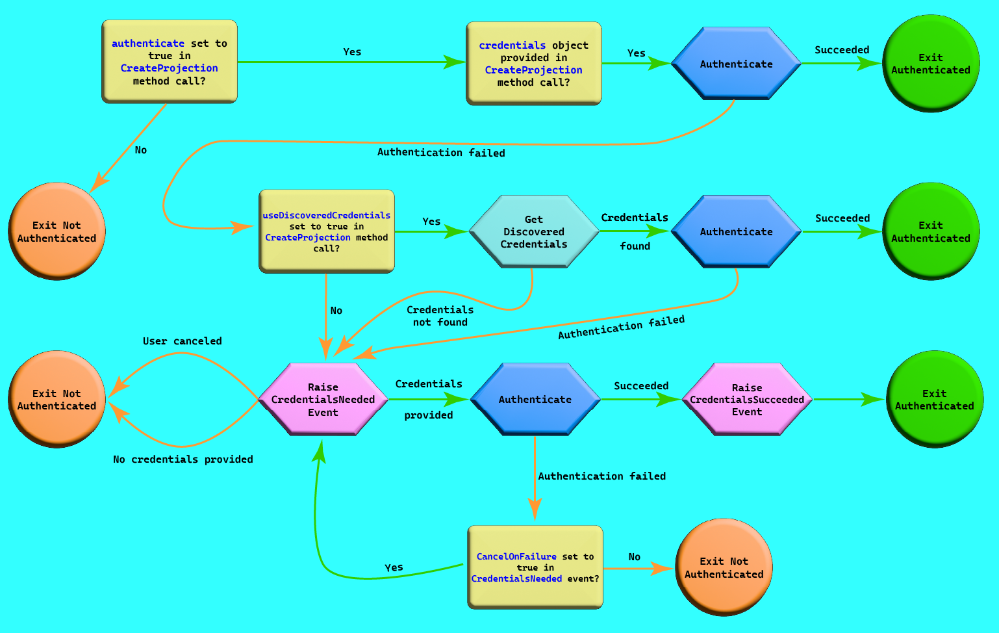

# J4JMapLibrary: Using the Projection Factory

## Overview

- [Ensuring Your Credentials Can Be Found](#ensuring-your-credentials-can-be-found)
- [Creating the Factory](#creating-the-factory)
- [Creating a Projection](#creating-a-projection)
- [Authentication](#authentication)
- Custom Projections and Credentials
  - [Scanning for Custom Projections and Credentials](#scanning-for-custom-projections-and-credentials)
  - [Ensuring Custom Projections Can Be Found](#ensuring-custom-projections-and-credentials-can-be-found)
  
While it's fairly straightforward to create a projection, in order to make it possible to do so by choosing one of the caches at run time inspired me to write `ProjectionFactory`.

The basic process for using it is:

- create and instance of `ProjectionFactory`
- tell it whatever custom projection/credentials assemblies you want it to search (by default, it automatically searches the `J4JMapLibrary` assembly, although you can keep it from doing so by specifying a flag when you create the instance)
- call the `InitializeFactory()` method
- use one of the `Create...` methods to create a projection

The factory will attempt to authenticate a projection when it is created. See the [Authentication](#authentication) section for details.

In order for the factory to work, however, two things are necessary:

- all authentication information must be available through the `IConfiguration` system; and,
- you must have the factory scan whatever assemblies contain `Projection` classes. By default, the factory will scan the library itself, so the four default projections -- Bing Maps, Google Maps, Open Street Maps and Open Topo Maps -- will be included.

This is covered in more detail below.

## Ensuring Your Credentials Can Be Found

To make a projection's credential information available through the `IConfiguration` system, it must be organized in a configuration section called **Credentials**, further identified by the corresponding projection's name. That's so the following code can work:

```csharp
var credentials = (ICredentials) Activator.CreateInstance( t )!;

var configSection = _config.GetSection( $"Credentials:{credentials.ProjectionName}" );
configSection.Bind( credentials );

_credentials.Add( (ICredentials) credentials );
```

The built-in projections have the following names:

|Projection Class|Name|
|----------|----|
|`BingMapsProjection`|BingMaps|
|`GoogleMapsProjection`|GoogleMaps|
|`OpenStreetMapsProjection`|OpenStreetMaps|
|`OpenTopoMapsProjection`|OpenTopoMaps|

For more details on custom credentials and projections, consult the [documentation on how to create custom projections and credentials](custom-projections.md).

[return to table of contents](#overview)

[return to usage table of contents](usage.md#overview)

## Creating the Factory

The factory constructor takes the following parameters:

|Parameter|Parameter Description|
|---------|---------------------|
|`IConfiguration` config|provides access to the Microsoft configuration system|
|`ILoggerFactory?` loggerFactory = null|optional; provides access to the Microsoft logging factory|
|`bool` includeDefaults = true|default (true) is to scan the library itself|

*You must call `InitializeFactory()` before attempting to use it*. It returns `true` if at least one `Projection` class was found, `false` otherwise. Initialization is somewhat fragile because a lot of reflection is used in order to locate the projection classes and their corresponding credential classes.

[return to table of contents](#overview)

[return to usage table of contents](usage.md#overview)

## Creating a Projection

Once you've initialized the factory you can call one of its creation methods to obtain a projection, all of which return an instance of `ProjectionFactoryResult`. Each comes in both synchronous and asynchronous forms.

### CreateProjection(), CreateProjectionAsync()

|Parameter|Parameter Description|
|---------|---------------------|
|`string` projName|the name of the projection (see below)|
|`object?` credentials = null|the credentials to use to authenticate the projection (optional)|
|`bool` useDiscoveredCredentials = true|a flag indicating whether credentials from the `IConfiguration` system should be used if `credentials` is null (optional)|
|`bool` authenticate = true|controls whether or not to authenticate the projection after it's created (default: true)|

### Generic CreateProjection&lt;TProj&gt;(), CreateProjectionAsync&lt;TProj&gt;()

|Parameter|Parameter Description|
|---------|---------------------|
|`TProj`|the projection type (e.g., `BingMapsProjection`)|
|`object?` credentials = null|the credentials to use to authenticate the projection (optional)|
|`bool` useDiscoveredCredentials = true|a flag indicating whether credentials from the `IConfiguration` system should be used if `credentials` is null (optional)|
|`bool` authenticate = true|controls whether or not to authenticate the projection after it's created (default: true)|

### Type-based CreateProjection(), CreateProjectionAsync()

|Parameter|Parameter Description|
|---------|---------------------|
|`Type` projType|the projection type (e.g., `typeof(BingMapsProjection)`)|
|`object?` credentials = null|the credentials to use to authenticate the projection (optional)|
|`bool` useDiscoveredCredentials = true|a flag indicating whether credentials from the `IConfiguration` system should be used if `credentials` is null (optional)|
|`bool` authenticate = true|controls whether or not to authenticate the projection after it's created (default: true)|

The names of the built-in projections are listed in the [Ensuring Your Credentials Can Be Found](#ensuring-your-credentials-can-be-found) section.

[return to table of contents](#overview)

[return to usage table of contents](usage.md#overview)

## Authentication

When a projection is created the factory attempts to authenticate it. It does so by trying credentials from various sources until one succeeds, the user fails to provide additional credentials, or cancels the authentication process.

Requests for credentials are made through the `CredentialsNeeded` event, whose event argument is an instance of `CredentialsNeededEventArgs`, which contains the following properties:

|Property|Type|Nature|Comments|
|--------|----|------|--------|
|`ProjectionName`|`string`|read-only|specifies the projection for which credentials are being requested|
|`Credentials`|`object?`|read/write|set this to user-supplied credentials (defaults to `null`)|
|`CancelImmediately`|`bool`|read/write|set to `true` to cancel authentication (defaults to `false`)|
|`CancelOnFailure`|`bool`|read/write|set to `true` to cancel if the next authentication attempt fails (defaults to `false`)|

How you respond to a `CredentialsNeeded` request, or whether you respond at all, is up to you in designing the app using `J4JMapLibrary`.

The overall flow of the credentialing process is somewhat involved. Here's a picture detailing it:



If authentication succeeds based on a response to the `CredentialsNeeded` event, a second event, `CredentialsSucceeded`, is raised so you can save the new/revised credentials for future use. Its event argument contains the successful credentials object:

|Property|Type|Comments|
|--------|----|--------|
|`ProjectionName`|`string`|specifies the projection for which credentials are being requested|
|`Credentials`|`object?`|the successful credentials|

[return to table of contents](#overview)

[return to usage table of contents](usage.md#overview)

## Scanning for Custom Projections and Credentials

To have the factory include custom projection and credential classes you may have written you need to call one of the `ScanAssembly()` methods before calling `InitializeFactory()`. The `ScanAssemblies()` methods return the `ProjectionFactory` itself, so they can be daisy-chained.

[return to table of contents](#overview)

[return to usage table of contents](usage.md#overview)

## Ensuring Custom Projections and Credentials Can Be Found

If you create a custom projection class you must deocrate it with a `ProjectionAttribute` in order for the factory to find it when it scans the assembly where it's defined. Here's an example of how the built-in `BingMapsProjection` class is named:

```csharp
[ Projection( "BingMaps" ) ]
public sealed class BingMapsProjection : TiledProjection<BingCredentials>
```

Projection names must be unique within the application's environment, so be sure not to duplicate any of the built-in names.

Custom credentials for a custom projection/map service must implement the `ICredentials` interface:

```csharp
public interface ICredentials
{
    Type ProjectionType { get; }
    string ProjectionName { get; }
}
```

To simplify doing this you can derive your custom credentials class from `CredentialsBase`:

```csharp
public class CredentialsBase : ICredentials
{
    protected CredentialsBase(
        Type projectionType
    )
    {
        ProjectionType = projectionType;

        var attribute = projectionType.GetCustomAttribute<ProjectionAttribute>();
        ProjectionName = attribute?.ProjectionName ?? string.Empty;
    }

    public Type ProjectionType { get; }
    public string ProjectionName { get; }
}
```

`CredentialsBase` assumes your custom projection class is decorated with a `ProjectionAttribute`, which it uses to look up the unique name of the projection.

Custom credentials classes can implement whatever properties they need to for that projection's authentication. Here's what `GoogleCredentials` looks like:

```csharp
public class GoogleCredentials : CredentialsBase
{
    public GoogleCredentials()
        : base( typeof( GoogleMapsProjection ) )
    {
    }

    public string ApiKey { get; set; } = string.Empty;
    public string SignatureSecret { get; set; } = string.Empty;
}
```

For more details on custom credentials and projections, consult the [documentation on how to create custom projections and credentials](custom-projections.md).

[return to table of contents](#overview)

[return to usage table of contents](usage.md#overview)
