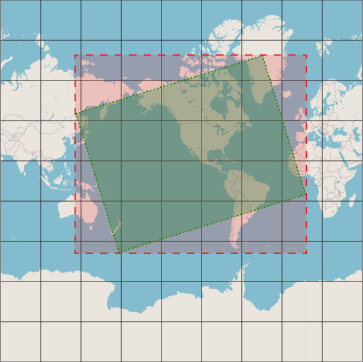

# J4JMapLibrary: The MapRegion Object

## Overview

- [Interface](#interface)
- [Defining the Display Area](#defining-the-display-area)
- [Accessing the Images](#accessing-the-images)
  - [Events](#events)
  - [MapTiles](#maptiles)
- [Other Properties and Methods](#other-properties-and-methods)

At the heart of how image data is returned by the various `Projection` retrieval methods is the `MapRegion` object. It serves as the junction between the display coordinate system -- where the images will ultimately be displayed -- and the `Projection` coordinate system, which defines the geometry of a projection at a given scale.



`MapRegion` is aware of all three rectangles in the above image, the underlying map rectangle (which is always square but wraps around at the right and left edges), the desired display area (the green rectangle) and the region that needs to be retrieved from the map service in order to fill the display area (the red bounding box).

*`MapRegion` does not, itself, retrieve any images. Instead, it defines what images need to be retrieved from the `Projection` it's associated with, and provides a target for the projection's retrieval methods to use to store images.*

## Interface

Consequently, it is a rather complex object:

```csharp
event EventHandler? ConfigurationChanged;
event EventHandler<RegionBuildResults>? BuildUpdated;

IProjection Projection { get; }
ProjectionType ProjectionType { get; }

bool IsDefined { get; }
bool Changed { get; }

float CenterLatitude { get; }
float CenterLongitude { get; }
MapPoint Center { get; }
float CenterXOffset { get; }
float CenterYOffset { get; }
float RequestedHeight { get; }
float RequestedWidth { get; }
int Scale { get; }
float Heading { get; }
float Rotation { get; }

MapRegion Update();
MapRegionChange RegionChange { get; }

MapTile[ , ] MapTiles { get; }
MapTile? this[ int xRelative, int yRelative ] { get; }
IEnumerator<MapTile> GetEnumerator();

int WrapXOffsetWithinProjection( int offsetX );

Tile UpperLeft { get; }
Rectangle2D BoundingBox { get; }
Vector3 ViewpointOffset { get; }

int MaximumTiles { get; }
int TilesWide { get; }
int TilesHigh { get; }
float TileWidth { get; }
float TileHeight { get; }
```

[return to table of contents](#overview)

[return to usage](usage.md)

## Defining the Display Area

The basic concept behind using `MapRegion` is simple:

- define the projection to use (this is done in the constructor)
- define the area of the projection you want to display (by setting the `Center`, `RequestedHeight`, `RequestedWidth`, `Scale` and `Heading` properties)
- call `Update()` (this triggers the actual image retrieval)
- access the `MapTile` objects you need

However, rather than define the area to display by setting properties you use extension methods (that's why the properties show as read-only in the list above -- they have hidden internal setters).

Here are the display area extension methods. Each returns the `MapRegion` object it modifies, so they can be daisychained:

```csharp
CenterLatitude( this MapRegion.MapRegion region, float value )
CenterLongitude( this MapRegion.MapRegion region, float value )
Center( this MapRegion.MapRegion region, float latitude, float longitude )

Offset( this MapRegion.MapRegion region, float xOffset, float yOffset )

Scale( this MapRegion.MapRegion region, int value )

RequestedHeight( this MapRegion.MapRegion region, float value )
RequestedWidth( this MapRegion.MapRegion region, float value )
Size( this MapRegion.MapRegion region, float height, float width )

Heading( this MapRegion.MapRegion region, float value )
```

There are convenience methods for setting latitude/longitude and height/width simultaneously, since those are usually defined and available together.

The `Offset()` extension method is designed to support UI events which move the center point of the map, not by changing latitude or longitude, but by *offsetting* the center a specific number of pixels in the X (horizontal) and Y (vertical) directions.

[return to table of contents](#overview)

[return to usage](usage.md)

## Accessing the Images

You'll notice that the `Update()` method simply returns its `MapRegion` instance. It does not return any images or, indeed, results of any kind.

That's because most of the time I expect `MapRegion` will be used in a multi-threaded UI environment where the results cannot simply be applied on whatever thread trigggered an update.

Instead, `MapRegion` communicates with the app that defines it through events and the properties it sets on itself when it does an update.

[return to table of contents](#overview)

[return to usage](usage.md)

### Events

There are two events which communicate changes in `MapRegion`'s state, `ConfigurationChanged` and `BuildUpdated`.

`ConfigurationChanged` signals that the area to be displayed has changed and an update is needed. That change can be to any one of the display area properties described above. The cause of the change is not communicated, since more than one display area property is often changed "simultaneously".

This also means there can be a flurry of `ConfigurationChanged` events. Consequently, the app will generally have to throttle them so as not to trigger too many calls to `Update()`.

The second event, `BuildUpdated`, signals when the call to `Update()` is complete. It contains information about what happened during the update via its `MapRegionChange` argument.

`MapRegionChange` can take on one of several values:

|Value|Meaning|
|-----|-------|
|Empty|no display area is defined (typically this means `RequestedHeight` or `RequestedWidth` is 0)|
|NoChange|the pre-existing collection of retrieved images did not have to be updated to satsify the request (this can happen if a change involves a "small" shift which results in the set of tiles being unchanged; note that this only applies to *tiled* projections, as any shift in a *static* projection requires a web query)|
|OffsetChanged|the pre-existing collection of retrieved images did not have to be updated to satsify the request but the offset (of the display area relative to the bounding box's corresponding edge) did change|
|LoadRequired|enough of a change occurred that the tile collection had to be reloaded|

The differing `MapRegionChange` values are intended to minimize the depth of update needed to be done in the calling application's user interface.

[return to table of contents](#overview)

[return to usage](usage.md)

### MapTiles

The `MapTile`s defined by `Update()` can be accessed in one of three ways:

|Name|Nature|Return Value|Description|
|----|------|------------|-----------|
|`MapTiles { get; }`|property|`MapTile[ , ]`|two dimensional array of `MapTile` objects|
|`this[ int xRelative, int yRelative ]`|indexer|`MapTile?`|`xRelative` and `yRelative` are the integer coordinates defining where a `MapTile` fits into the overall tile collection *relative to the upper-left corner of the collection*. Owing to a display area potentially wrapping around the projection, `xRelative` and `yRelative` may not correspond directly to the *projection's* tile coordinate scheme.|
|`GetEnumerator()`|enumerator|`MapTile`|an enumerator which steps through the `MapTile` collection. This is done starting from the upper left corner of the collection, row by row (i.e., columns are traversed before the next row is processed). Again, due to wraparound, "earlier" tiles may actually be "later" in terms of the *projection's* perspective.|

[return to table of contents](#overview)

[return to usage](usage.md)

## Other Properties and Methods

`MapRegion` defines a number of other properties based on how it's configured. Here are brief explanations of them:

|Property|Type|Description|
|--------|----|-----------|
|`Projection`|`IProjection`|the `Projection` object to which the `MapRegion` is related|
|`ProjectionType`|`ProjectionType`|`ProjectionType.Static` indicates the underlying projection is an `IStaticProjection`<br>`ProjectionType.Tiled` indicates the underlying projection is an `ITiledProjection`|
|`IsDefined`|`bool`|`true` means `Update()` has been called and succeeded, `false` means it either hasn't been called (the typical case) or it failed|
|`Changed`|`bool`|`true` means some aspect of the display area configuration has changed since the last `Update()`, `false` means the display area is unchanged|
|`RegionChange`|`MapRegionChange`|the result of the last `Update()` (see above discussion for details)|
|`UpperLeft`|`Tile`|the tile coordinates of the upper left corner of the `MapTile` collection *from the perspective of the projection*. This can be 'unusual' due to wraparound effects|
|`BoundingBox`|`Rectangle2D`|the 'normal' rectangle (i.e., not rotated) which encloses the (possibly rotated) display area|
|`ViewpointOffset`|`Vector3`|this is the offset, in terms of pixels, between the upper left corner of the display area and the upper left corner of the bounding box *from the perspective of the display area*. It's important for positioning the images properly in an applications UI.|
|`MaximumTiles`|`int`|the number of horizontal or vertical tiles in the projection at the current map scaling factor|
|`TilesWide`|`int`|the horizontal dimension (number of tiles) in *the current `MapTile` collection*|
|`TilesHigh`|`int`|the vertical dimension (number of tiles) in *the current `MapTile` collection*|
|`TileWidth`|`float`|the width, in pixels, of a `MapTile` at the defined map scale. Note that for `IStaticProjection`s this is always equal to `RequestedWidth` since `IStaticProjection`s only ever return a single `MapTile`.|
|`TileHeight`|`float`|the height, in pixels, of a `MapTile` at the defined map scale. Note that for `IStaticProjection`s this is always equal to `RequestedHeight` since `IStaticProjection`s only ever return a single `MapTile`.|

`MapRegion` also defines a `WrapXOffsetWithinProjection()` method:

```csharp
int WrapXOffsetWithinProjection( int offsetX );
```

It's used by `MapTile` to handle wraparound effects when configuring the `MapTile`.

[return to table of contents](#overview)

[return to usage](usage.md)
