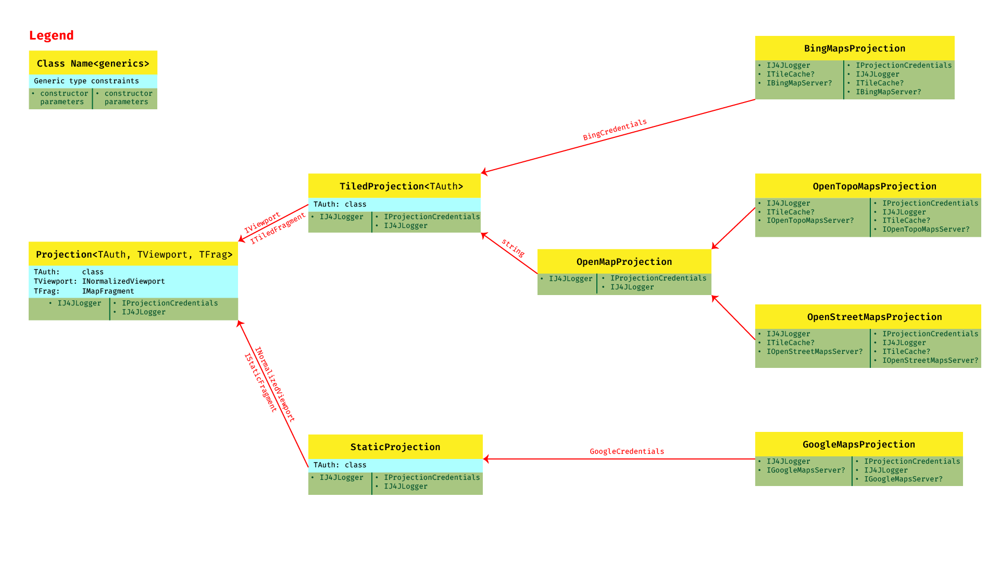

# J4JMapLibrary: Overview

## A Little History

J4JMapLibrary is the second time I attempted to write a library for accessing multiple online map services. As involved as the current library is, the first attempt was far more complicated. In fact, while it worked, sort of, it was difficult even for me, the author, to use it.

Interestingly, the differences were all due to the different starting points I chose for writing the two libraries. My first attempt started from the perspective of the Windows app in which I wanted to include map imagery. That worked, but I quickly got deep into weeds trying to keep things straight (e.g., Windows apps and map services use very different coordinate systems for locating points).

This second library came together when I decided to start with the map services and figure out what they could provide, deferring details on how the imagery would be displayed to the Windows app environment. That simple shift of perspective turned a nearly intractable problem into one which could be solved, albeit with a fair bit of code. But it was a lot of much simpler code, because it didn't try to do "too much" at any given "level" of abstraction.

## Necessary Abstractions

Creating a single library to access multiple map services requires a number of abstractions. This is due to each service being implemented in different ways. Examples of these differences include:

- Tiled vs static image retrieval
- Whether or not authentication is required to access the service
- Fixed retrieval URLs versus dynamically assigned retrieval URLs

Through some design and much trial and error the architecture I came up with to address these differences is based on two principles:

- Split the code base between tiled services and static services; and,
- Separate the access specific details from the image retrieval details.

This is summarized visually in the following diagram:

## Projection: It All Starts Here

The root object of all the projections is `Projection`. It has three generic type parameters:

- **TAuth**: the type of object holding the projection's authentication credentials.
- **TViewport**: the type of object holding the information defining the viewport, the section of the map imagery to be retrieved. For tiled services the section can span multiple tiles. This must be a class implementing the `INormalizedViewport` interface, which allows specification of the viewport's center point (via latitude and longitude), height and width, and the zoom/scale factor.
- **TFrag**: the type of object holding the image data ("map fragment") which will be returned by the retrieval process. For tiled services the actual image retrieval can be deferred or may be extracted from a set of cached images. For static services `TFrag` will always include the image data. `TFrag` classes must implement the `IMapFragment` interface, which contains, among other things, the map image data and a method for retrieving that data from the server.

While there a number of properties which can be set or must be set on a `Projection`, there are only two constructors, one taking a single parameter (an instance of `ILogger`, to support logging) and one containing an instance of `ILogger` and an instance of `IProjectionCredentials`. The second constructor supports automatically authenticating the projection based on stored credentials while the former requires explicit authentication, by calling the projection's `AuthenticateAsync()` method.

## Tiled and Static Projections

The next level above `Projection` shows the split between tiled services, supported by `TiledProjection`, and static services, supported by `StaticProjection`. Both `TiledProjection` and `StaticProjection` specify two of the three generic type parameters required by `Projection`, represented by the text shown along the arrows representing the type hierarchy.

The viewport information for instances of `TiledProjection` must implement the `IViewport` interface. This extends `INormalizedViewport` to include a heading parameter, which indicates how the viewport rectangle may be rotated relative to the traditional north/south/east/west orientation.

The map fragment instances retrieved by `TiledProjection` must implement the `ITiledFragment` interface. This extends `IMapFragment` to include the height/width of retrieved tiles and the quadkey string uniquely identifying a tile (which is required to retrieve tiles from the Bing Maps service and useful as an identifier for all tiled services).

`StaticProjection` only requires viewport objects that implement `INormalizedViewport`. But the map fragment instances retrieved by `StaticProjection` must implement the `IStaticFragment` interface, which extends `IMapFragment` to include the center point latitude and longitude.
